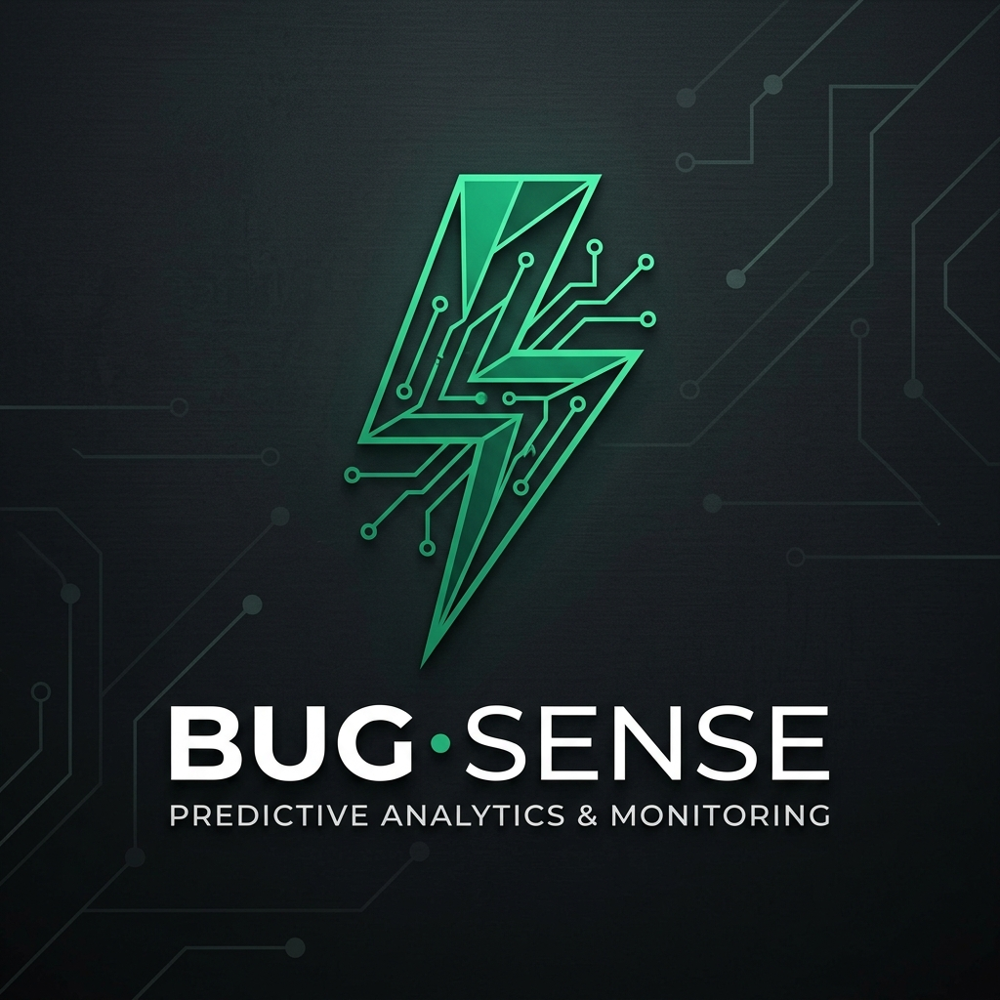

<p align="center">
  
</p>

# BugSense

### **Stop Copy-Pasting. Start Learning.**

BugSense is an AI-powered tool that changes how you fix code. Instead of just giving you a solution to copy-paste, it acts like a coding mentor. It helps you find the root cause of your bugs, verifies your fix, and saves everything into a personal library so you never forget how you solved it.

---

## 🚀 Key Features

### 🧠 Guided Debugging
BugSense doesn't just "fix it" for you. Powered by Gemini AI, it asks smart questions and gives helpful hints to guide you toward the solution yourself. This helps you actually understand your code better.

### 📚 Personal Troubleshooting Library
Once you solve a bug, BugSense writes a simple summary of the fix. This is saved in your own library, making it easy to search and find solutions to the same problem in the future.

### ⚡ Clean & Modern Workspace
A professional, distraction-free interface designed to help you focus. Features instant AI chat, a clear history of your sessions, and a smooth, premium feel.

---

## 🖼️ Visual Tour

### 🏠 Home Page - Start Here


### 💬 The Workspace - AI Guidance in Action


### 📝 Saved Solutions - Clear Summaries


---

## 🛠️ Built With

- **Frontend**: React & Vite (for speed), Tailwind CSS (for style).
- **Backend**: Node.js & MongoDB (for data).
- **AI Brain**: Gemini (for smart debugging guidance).

---

## 🏗️ Getting Started

### What you need
- Node.js (v18+)
- MongoDB
- A Gemini API Key from Google

### Installation

1. **Clone the Project**
   ```bash
   git clone <your-repo-url>
   cd "Bug Sense"
   ```

2. **Step 1: Set up the Server**
   ```bash
   cd server
   npm install
   # Add your API keys to the .env file
   npm run dev
   ```

3. **Step 2: Set up the Client**
   ```bash
   cd client
   npm install
   npm run dev
   ```

---

## 📝 License
Copyright © 2026 Manish. **All Rights Reserved.**

This software is proprietary. No part of this project may be copied, modified, or distributed without explicit permission from the owner.
